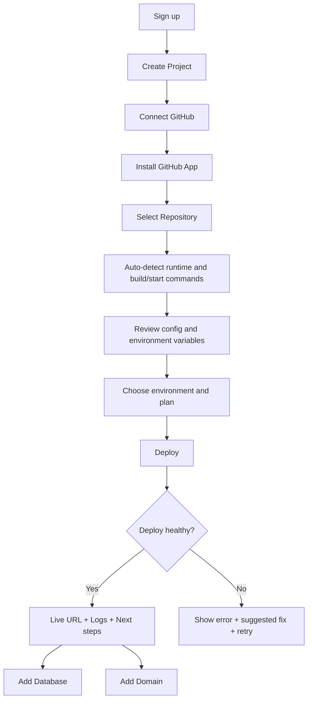
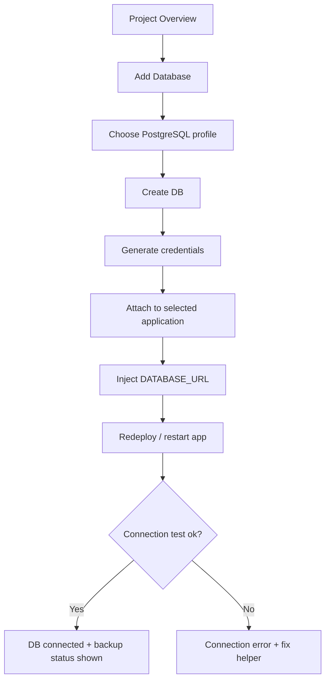
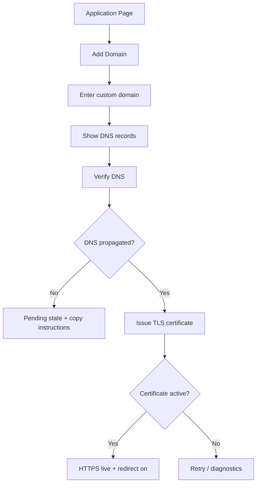

# GTM и продуктовый план для небольшой GitOps-backed cloud platform

> **CANONICAL PRODUCT VISION — ориентируемся сюда.** Самое свежее продуктовое видение (deep-research). Любой landing/console/roadmap/feature вопрос сверяй с этим документом. Конкретные фичи (PRD/ADR) должны ложиться в матрицу ниже и не противоречить ставке.

## Anchors (TL;DR — читать первым)

- **Продуктовая ставка:** не «упрощённый Kubernetes», а **Backend Cloud для стартапов и небольших команд без DevOps**. Один путь: `GitHub → backend → Postgres → домен → HTTPS → логи → rollback`. Язык — **outcomes, не infra-jargon** (никаких GitOps/Crossplane/ArgoCD/Kubernetes в hero).
- **ICP:** solo-founder / vibe coder, маленький стартап (2–10), небольшое агентство, backend-dev/tech-lead. Фокус 2–3 сегмента, не шире.
- **Год-1 цель = ACTIVATION, не breadth.** Главный KPI: median time-to-first-deploy ≤ 10 мин; first-deploy success ≥ 60%; onboarding completion ≥ 40%.
- **Feature priority (§ Матрица функциональности):** MVP = GitHub deploy, DB provisioning, Domains/SSL, **Monitoring**, Rollback, Roles/Projects, Templates, Pricing/Onboarding. Next = Backups, Environments, CI. Q2+ = Object storage, Preview envs.
- **Roadmap (§ Дорожная карта, 12 мес):** 1–2 Activation core → 3–4 DB+Domains → 5–6 Reliability (rollback/backups) → 7–8 Templates+Team → 9–10 Monetization → 11–12 Expansion (storage, previews).
- **Каналы (§ Каналы роста):** founder-led outbound + community answering (very high); build-in-public, templates, agency partnerships (high). CAC считать с зарплатами.
- **Главные риски:** слишком широкий ICP; продажа «инфры» вместо результата; слабая activation; недоверие к надёжности; неясная цена.

### Как это бьётся с текущей работой

- **Monitoring** в матрице (MVP, «жив ли сервис, где проблема») = базовая observability задеплоенных аппов. Уже **shipped** — [PRD-monitoring](../prd/PRD-monitoring.md).
- **Telemetry gateway** (OTLP push, IoT-клиент — [ADR-012](../adr/ADR-012-telemetry-gateway.md)) — это **expansion/adjacent bet ЗА пределами** core-ставки этого документа. Полезно конкретному клиенту, но НЕ должно опережать activation-core и НЕ должно размывать backend-cloud messaging на лендинге. Держать отдельной продуктовой линией.

> Токены `citeturn…` в тексте — артефакты ресёрч-тула (битые ссылки на источники). Контент валиден; токены игнорировать/чистить при редактуре.

---

## Executive summary

Для небольшой GitOps-backed cloud platform наилучший стартовый вектор — не пытаться продавать “упрощённый Kubernetes”, а продавать **быстрый и предсказуемый путь от GitHub к рабочему backend‑сервису** для соло‑разработчиков, маленьких стартапов и небольших агентств. Именно эти сегменты сильнее всего ценят короткий time-to-value, понятную цену, встроенные БД и домены, а также возможность “не думать про инфру” после первого деплоя. Современные baseline‑ожидания здесь уже заданы Vercel, Railway и Render: импорт репозитория и автодеплой из Git, preview/staging environments, custom domains с managed TLS, zero-config Postgres, логи и метрики, быстрый rollback, шаблоны и понятное ценообразование. citeturn9view0turn9view3turn9view1turn9view2turn9view5turn10view1turn9view14turn10view2turn9view15turn9view11turn9view19

Ниже я исхожу из того, что **география, команда, SLA, compliance-требования, региональное покрытие, unit economics инфраструктуры и текущая конверсионная воронка не указаны**. Поэтому дорожная карта, KPI и CAC‑диапазоны — это рабочие гипотезы для ранней стадии, а не финансовый forecast. В качестве product bet я рекомендую позицию: **“backend cloud для стартапов и product-команд без выделенного DevOps”**. Такая ставка лучше согласуется с практикой devtools GTM: на ранней стадии критичны outbound‑motion, founder-led продажи, быстрые пилоты, контент и community, а по мере роста усиливаются события, SEO и кейсы. High Alpha отмечает, что outbound особенно важен на ранней стадии, а events / conferences / real-world interactions в 2025 году были одним из самых результативных каналов across ARR bands; Mattermost отдельно подчеркивает, что developer tools требуют отдельной GTM-логики, а не “обычной B2B SaaS” упаковки. citeturn15view0turn15view2turn15view3

Ключевой вывод: в первый год продукт должен максимизировать не breadth платформы, а **activation**. Самые важные задачи — сократить время до первого деплоя, упростить привязку БД и домена, сделать rollback и логи очевидными, ввести onboarding checklist, добавить 2–4 opinionated template‑стека, а лендинг переписать с языка “GitOps / Kubernetes / infra primitives” на язык **исходов пользователя**: “Подключите GitHub”, “Запустите backend за 5 минут”, “Добавьте Postgres и домен без DevOps”. Это соответствует тому, как конкуренты формулируют ценность: Render прямо продвигает “intuitive infrastructure” и “click, click, done”, Vercel — zero-config deploy / collaboration / custom domains / previews, Railway — deploy in minutes, all-in-one platform, templates и zero-config database flows. citeturn10view0turn13view1turn18view2

## Рынок и продуктовая ставка

### Какие UX-ожидания уже сформированы рынком

Если ориентироваться на официальный DX ведущих платформ, рынок уже привык к очень конкретному набору ожиданий. У Vercel подключение Git-репозитория автоматически запускает deploy flow, даёт preview URLs и обновления custom domains; preview environments по умолчанию создаются для non‑production branches и PR; custom domains конфигурируются из проекта, а TLS выпускается автоматически после успешной DNS‑валидации; instant rollback — отдельный first-class сценарий. citeturn9view0turn9view3turn9view1turn9view2turn1search1

Railway задаёт ожидание zero-config инфраструктурных примитивов: Postgres можно добавить из проекта буквально через New / Command palette, observability уже встроен, а templates позволяют тиражировать рабочие конфигурации между проектами и командами. У Railway также есть workspace/project roles и usage limits, что критично для маленьких команд и агентств, которым нужны базовые guardrails без тяжёлого enterprise‑RBAC. citeturn9view5turn9view8turn9view11turn9view9turn9view10turn20search0turn20search2

Render, в свою очередь, задаёт full-stack baseline: deploy из Git, zero-downtime redeploys, metrics и logs в dashboard, custom domains с автоматическим TLS, service previews, instant rollbacks, persistent disks, Postgres с connect menu и PITR на платных планах. Важно и то, что Render очень явно разводит “free preview experience” и “production usage”: free web services spin down after 15 minutes idle, free Postgres ограничен и не предназначен для production. citeturn10view1turn10view2turn9view14turn10view7turn9view15turn9view13turn9view6turn12view1

### Приоритетные сегменты

| Сегмент | Job-to-be-done | Что делает сейчас | Почему может купить у вас | Что нельзя обещать на старте |
|---|---|---|---|---|
| Соло-founder / vibe coder | Поднять backend и забыть про инфру | VPS + Docker Compose + Claude; иногда Vercel + внешняя БД | Одна панель, GitHub→prod, Postgres, домен, rollback, без YAML | “Мы заменим AWS для любого кейса” |
| Маленький стартап | Быстро запускать staging/prod, не держать DevOps | Render / Railway / Vercel + отдельная БД / VPS | Более дешёвый и более opinionated backend cloud | Сложный multi-region / compliance-heavy enterprise |
| Небольшое агентство / аутсорс | Управлять многими клиентскими проектами в одной панели | Парк VPS, ручные домены, хаос с доступами | Projects, roles, шаблоны стеков, predictable billing | Полноценный MSP / enterprise access governance |
| Backend-разработчик / tech lead | Сделать repeatable deploy flow для команды | GitHub Actions + Compose / k8s / Render | Единый flow, меньше ручной настройки, меньше DevOps-знаний | “Глубокий control plane для платформенной команды” |

### Рекомендуемая продуктовая ставка

На ранней стадии лучше работать с **одной чёткой категорией**:

> **Backend Cloud для стартапов и небольших команд**  
> GitHub → backend → Postgres → домен → HTTPS → логи → rollback.

Это лучше, чем “GitOps Cloud Platform”, по двум причинам. Во‑первых, язык outcomes конвертирует лучше, чем язык implementation details. Во‑вторых, GitOps/Kubernetes интересны лишь части технических покупателей, а основной покупатель раннего продукта хочет результат, а не control plane. Такая формулировка также лучше сочетается с usage-based или hybrid pricing: Stripe отдельно подчёркивает, что value metric должен быть **предсказуемым и контролируемым** клиентом, иначе pricing начинает разрушать доверие. citeturn9view19

## Матрица функциональности

Ниже — рекомендуемая продуктовая матрица. Это **не описание того, что уже есть**, а целевая карта, вокруг которой имеет смысл переписать лендинг, консоль, onboarding и roadmap. Пороговые acceptance criteria здесь предложены как целевые продуктовые стандарты для ранней стадии.

| Feature | Ключевой сценарий пользователя | Acceptance criteria | Primary user persona(s) | Success metric | Implementation complexity | Priority |
|---|---|---|---|---|---|---|
| GitHub deploy | Пользователь подключает GitHub, выбирает repo, получает live URL | Signup → live URL ≤ 7 мин p50; install GitHub App ≤ 3 экранов; автоопределение runtime/build/start/port ≥ 80% для top stacks; first deploy success rate ≥ 70% | Соло-founder, backend dev, стартап | Activation rate; median time-to-first-deploy | Med | MVP |
| DB provisioning | Пользователь создаёт Postgres и подключает его к приложению без ручного копирования env | Create DB ≤ 120 сек; “Attach to app” инжектит `DATABASE_URL` в 1 действие; connection test pass ≥ 95%; credentials never shown after initial reveal | Стартап, backend dev, агентство | % activated accounts with app+DB in 7 days | Med | MVP |
| Domains / SSL | Пользователь добавляет custom domain и получает HTTPS | Domain wizard ≤ 3 шага; DNS instructions copy-paste ready; certificate status виден явно; HTTPS active ≤ 15 мин после DNS propagation | Стартап, агентство, founder | % production apps with custom domain in 14 days | Med | MVP |
| Backups | Пользователь уверен, что БД можно восстановить после ошибки | Daily backups enabled by default on paid DB; restore to latest backup ≤ 15 мин; ежемесячный restore drill success ≥ 99%; RPO v1 ≤ 24ч, затем PITR | Стартап, агентство | % paid DBs with backups on; restore success rate | High | Next |
| Monitoring | Пользователь быстро видит, жив ли сервис и где проблема | CPU/RAM/restarts/logs visible ≤ 60 сек; log search/filter works project-wide; 7-day retention v1; alert rules for crash/restart/error-rate v2 | Стартап, backend dev | log usage rate; incident time-to-diagnosis | Med | MVP |
| Rollback | Пользователь откатывает неудачный релиз одной кнопкой | Rollback to previous healthy deploy ≤ 60 сек; retain ≥ 5 deploys; clear warning if DB migrations are non-reversible | Стартап, backend dev | rollback adoption; deploy recovery time | Med | MVP |
| Environments | Пользователь разделяет prod / staging / preview без копипасты | prod + staging in ≤ 2 мин; env-scoped variables; protected production deploy; preview URL for non-main branches in v2 | Стартап, агентство | % projects with ≥ 2 environments | High | Next |
| Roles / Projects | Владелец создаёт проекты и даёт доступы команде / клиенту | Project create ≤ 30 сек; invite by email ≤ 60 сек; roles минимум Owner / Editor / Viewer; viewers can’t see secrets | Агентство, стартап | % workspaces with >1 member; permission errors | Med | MVP |
| Object storage | Пользователь создаёт bucket для файлов и получает S3-compatible endpoint | Bucket create ≤ 60 сек; S3 keys ready ≤ 1 мин; CORS/presigned URL presets; simple browser UI for files | Стартап, агентство | % apps using buckets; storage attach conversion | High | Q2+ |
| CI integration | Команда использует default git deploy или стандартный reusable workflow | GitHub App is default path; optional deploy hook / GH Actions template; commit status feedback to GitHub; docs for reusable workflow | Backend dev, стартап | % projects with automated redeploys | Med | Next |
| Templates / Stacks | Пользователь запускает opinionated stack в несколько кликов | Template deploy ≤ 5 мин; минимум 4 official templates; template update notice; docs + sample env vars included | Founder, агентство, startup | % activations via templates | Med | MVP |
| Pricing / Onboarding | Пользователь понимает цену и следующий шаг без звонка | Price estimate shown before deploy; hard spending cap / alerts; onboarding checklist; first-value checklist completion ≥ 50% | Все сегменты | trial-to-active conversion; paid conversion | Low-Med | MVP |

### Что эта таблица значит для продукта

Если сопоставить эту матрицу с тем, как сегодня обучают пользователя конкуренты, то видно: рынок уже считает “нормой” импорт репозитория, автодеплой, preview/staging, custom domains + TLS, basic observability, Postgres connect flow и templates как shortcut к working stack. Vercel, Railway и Render реализуют это по‑разному, но именно эти сценарии уже стали эталоном usability. GitHub при этом задаёт только plumbing‑уровень — reusable workflows, secrets, environments и GitHub App permissions — но не решает DX‑проблему платформы целиком. citeturn9view0turn9view3turn9view5turn9view8turn10view1turn10view2turn10view9turn10view4turn10view5turn10view6

Отдельно важно не переусложнить CI story. GitHub reusable workflows полезны, но GitHub прямо указывает, что environment secrets нельзя передавать через `workflow_call` так же гибко, как обычные secrets; поэтому лучший основной сценарий — **GitHub App / Git-integrated deploy без YAML**, а CI templates оставить как optional escape hatch для более зрелых команд. citeturn10view9turn9view16

## Копирайтинг и UX

### Рекомендуемая логика лендинга

Текущий лендинг, если позиционировать продукт как GTM-ready SaaS, должен сдвинуться от “облачная платформа / GitOps / Kubernetes / managed DBs” к **моменту первой ценности**. У конкурентов больше всего повторяются четыре категории сообщений: deploy in minutes, opinionated defaults, collaboration / previews, and reduced infrastructure burden. Render продаёт “intuitive infrastructure” и простую trilogию Select → Deploy → Platform does the rest; Railway акцентирует “deploy in minutes”, templates и all-in-one infra; Vercel — zero-config deploy, domains, previews и collaboration. citeturn10view0turn13view1turn18view2

#### Черновик копирайтинга для landing page

| Элемент | Рекомендуемый текст |
|---|---|
| Headline | **Запустите backend из GitHub за несколько минут** |
| Subhead | Подключите репозиторий, добавьте Postgres и домен, получайте стабильные деплои, логи и rollback — без отдельной DevOps-команды. |
| Hero CTA primary | **Подключить GitHub** |
| Hero CTA secondary | **Посмотреть live demo deploy** |
| Hero CTA tertiary | **Запросить пилот / миграцию с VPS** |
| Value proposition | GitHub → production без ручного CI/CD |
| Value proposition | База данных и домен в том же потоке, что и deploy |
| Value proposition | Логи, откат и понятные лимиты вместо “почему всё упало?” |
| Social proof hook | Как команда перевела backend с VPS + Compose в один проект без ручных SSH‑релизов |
| Social proof hook | Как стартап сократил запуск нового сервиса с часов до минут |
| Social proof hook | Как агентство централизовало домены, DB и доступы клиентов |
| Pricing teaser | Прозрачные планы для sandbox, solo и startup-team. Без сюрпризов по счёту, с hard limit и оценкой цены до deploy. |

#### Готовый промт для переработки лендинга

```text
Ты — senior conversion copywriter для developer tools / cloud PaaS.

Контекст продукта:
- Небольшая backend-focused cloud platform
- Основные сценарии: deploy из GitHub, managed Postgres, custom domains + SSL, logs/monitoring, rollback, projects/roles
- ЦА: solo founders, маленькие стартапы 2–10 человек, небольшие агентства
- Продукт НЕ должен звучать как “Kubernetes platform”; он должен звучать как “быстрый backend cloud без DevOps-команды”
- Желаемое позиционирование: “GitHub → backend → Postgres → домен → HTTPS → rollback”

Задача:
Создай лендинг на русском языке со следующей структурой:
1. Hero section
2. How it works в 3 шага
3. 3 ключевых value props
4. 3 сценария для сегментов
5. Case-study/social proof placeholders
6. Pricing teaser
7. FAQ objections
8. Footer CTA

Ограничения:
- Не используй слова GitOps, Crossplane, ArgoCD, Kubernetes в hero и первом экране
- Пиши на языке outcomes, а не implementation details
- Каждый блок должен отвечать на вопрос “зачем мне это сейчас”
- Избегай enterprise-jargon
- Нужны конкретные CTA, микрокопирайтинг для кнопок и подписи к screenshot sections
- Добавь 3 варианта headline и 3 варианта subhead
- Добавь section с objection handling: “у меня уже VPS”, “у нас есть GitHub Actions”, “мы ещё маленькие”
- Основной tone of voice: уверенный, простой, инженерный, без пафоса

Дополнительно:
- Для каждого блока укажи цель блока, целевую эмоцию пользователя и риск недопонимания
- В конце дай рекомендации, что тестировать A/B первым
```

### Рекомендуемая логика редизайна консоли

Для early-stage console критически важно сместить IA от “каталога инфраструктурных сущностей” к **task-oriented project workflow**. По UX‑паттернам конкурентов лучший якорь — проект как основной контейнер, а внутри него уже приложения, база, storage, domains, environments, observability и access. Railway и Render хорошо показывают ценность project/workspace abstraction; Vercel строит UX вокруг конкретного проекта и его deploy-циклов. citeturn9view9turn9view10turn10view0turn10view1turn10view3

#### Предлагаемая information architecture

| Уровень | Что должно быть |
|---|---|
| Workspace | Billing, members, usage limits, templates, audit-ish history |
| Project | Overview, Applications, Databases, Storage, Domains, Environments, Observability, Settings |
| Application | Deployments, Runtime config, Logs, Metrics, Domains, Env vars, Rollback |
| Database | Connect, Credentials, Backups, Metrics, Restore |
| Global nav | Workspaces switcher, project switcher, search, notifications, usage/cost |

#### Что упростить в первую очередь

| Проблема | Рекомендация |
|---|---|
| Слишком много infra-пунктов в левом меню | Спрятать глобальные сущности внутрь Project scope |
| Home не ведёт к первому value moment | Заменить project overview на “action dashboard”: Deploy app / Add DB / Add domain |
| Статусы маловыразительны | Ввести state system: Ready, Needs action, Error, Protected, Backup enabled |
| Нет явного next best action | Для каждой карточки добавить одну главную кнопку действия |
| Поток “deploy → db → domain” распадается на разные страницы | Сделать post-deploy checklist и cross-linking между действиями |

#### UI / UX acceptance criteria

| Область | Acceptance criteria |
|---|---|
| Первое использование | Новый пользователь может дойти от signup до первого live deploy, не открывая более 4 разных разделов |
| Onboarding | Checklist completion rate ≥ 50% среди новых workspace |
| Discoverability | Логи и метрики находятся ≤ 10 сек в модераторском usability test |
| Domains | Flow domain attach ≤ 3 шага, с явным статусом DNS / TLS / live |
| DB | Flow create+attach DB ≤ 2 минуты без ручного ввода connection string |
| Rollback | Кнопка rollback доступна из deploy history и из incident state |
| Empty states | Каждый empty state содержит: объяснение, next step, secondary link на docs |
| Responsive | На mobile доступны status, logs tail, redeploy, rollback confirm; сложные формы конфигурации можно сворачивать в read-mostly режим |

#### Черновик onboarding checklist

| Checklist item | Условие завершения |
|---|---|
| Подключите GitHub | GitHub App installed + repo linked |
| Сделайте первый deploy | Application status = Healthy |
| Добавьте Postgres | DB created |
| Подключите БД к приложению | `DATABASE_URL` injected + redeploy success |
| Добавьте домен | Domain added |
| Включите HTTPS | Certificate status = Active |
| Проверьте лимиты расходов | Hard limit or alert set |
| Пригласите участника | 2nd member invited or explicitly skipped |

#### Примеры микрокопирайта

| Контекст | Микрокопирайт |
|---|---|
| Успешный deploy | **Готово: сервис опубликован.** Посмотреть URL или добавить домен. |
| Ошибка DNS | **Нужно действие:** добавьте эту DNS-запись у регистратора и вернитесь на проверку. |
| Подключение БД | **Подключим автоматически:** строка соединения будет добавлена в переменные сервиса. |
| Rollback | **Откат к последнему стабильному deploy.** Код откатится, данные БД — нет. |
| Cost guardrail | **Защитите бюджет:** включите email alert или hard limit до первого production deploy. |

#### Wireframe suggestions

```text
[Top bar: Workspace ▼] [Project ▼] [Search] [Usage] [Notifications] [Avatar]

[Left nav inside Project]
Overview
Apps
Databases
Storage
Domains
Observability
Team
Settings

[Project Overview]
Title: Example Project
Status chips: prod / healthy / 1 app / 1 db / domain missing

[Primary action cards]
1. Deploy application
   Connect GitHub → Select repo → Review config
2. Add database
   Create Postgres → Attach to app
3. Add domain
   Add domain → Verify DNS → HTTPS

[Checklist]
☐ Connect GitHub
☐ First deploy
☐ Add Postgres
☐ Attach DB
☐ Add domain
☐ Enable cost limit

[Recent deploys] [Errors / alerts] [Usage snapshot]
```

#### Готовый промт для редизайна веб-консоли

```text
Ты — staff product designer и UX writer для developer infrastructure product.

Контекст:
- Продукт — небольшая backend cloud platform
- Есть сущности: workspace, project, app, database, storage, domains, deployments, monitoring, roles
- Основная проблема текущего UI: низкая интуитивность, меню перегружено infra-терминами, user journey не ведёт к first value
- ЦА: solo founders, backend developers, startup teams, small agencies
- Главный сценарий: GitHub deploy → добавить DB → добавить domain → получить stable production setup

Задача:
Сделай редизайн консоли на русском языке:
1. Предложи новую information architecture
2. Опиши dashboard первого проекта
3. Спроектируй onboarding checklist
4. Опиши empty states и success states
5. Спроектируй flow:
   - Deploy from GitHub
   - Add DB and auto-connect
   - Add domain and get SSL
6. Дай microcopy для статусов, ошибок, подтверждений и CTA
7. Учти responsive/mobile behavior
8. Укажи, какие действия должны быть на overview, а какие можно спрятать в advanced settings

Требования:
- Приоритизируй task-based навигацию, а не infra entity navigation
- Используй простые слова: “Приложение”, “База данных”, “Домен”, “Логи”, “Откат”
- Убери лишние аббревиатуры и облачный жаргон с первого экрана
- Для каждого экрана укажи primary CTA, secondary CTA, risk state, empty state
- Дай wireframe layout в текстовом виде
- Для каждого flow укажи acceptance criteria
- В конце дай список usability-тестов на 30 минут с пользователем
```

### Mermaid-схемы ключевых потоков

Эти флоу опираются на UX-ожидания, которые сегодня задают Git-integrated deploys, zero-config DB flows, domain verification и managed TLS у Vercel / Railway / Render. citeturn9view0turn9view5turn9view14







## Дорожная карта и приоритизация

### Логика приоритизации

Для ранней стадии здесь уместна **RICE‑приоритизация**, но с важной оговоркой: Reach, Confidence и Effort ниже — это **относительные оценки**, потому что ваша текущая воронка, размер активной аудитории и команда не указаны. Я использую milestone-level приоритизацию, а не issue-level backlog.

| Milestone | Reach | Impact | Confidence | Effort | RICE score | Почему сейчас |
|---|---:|---:|---:|---:|---:|---|
| Activation core | 10 | 3.0 | 0.85 | 3.5 | 7.3 | Увеличивает вероятность первого deploy и даёт основу для конверсии |
| DB + Domains core | 8 | 3.0 | 0.8 | 4.0 | 4.8 | Делает платформу production-usable |
| Reliability basics | 7 | 2.5 | 0.75 | 4.5 | 2.9 | Без rollback/backups доверие к продукту не растёт |
| Templates + Team workflows | 6 | 2.5 | 0.75 | 4.0 | 2.8 | Ускоряет ICP fit для стартапов и агентств |
| Billing guardrails + UX pricing | 7 | 2.0 | 0.85 | 3.0 | 4.0 | Критично для доверия и paid conversion |
| Storage + preview envs | 5 | 2.0 | 0.65 | 5.0 | 1.3 | Важно, но не должно опережать activation core |

### Приоритетный roadmap на двенадцать месяцев

Предположим минимальную команду из ролей-заглушек: **Founder/PM**, **Platform engineer**, **Product/full-stack engineer**, **part-time designer**, **Founder/Growth**. Если команда меньше, темп придётся снизить на 30–50%.

| Период | Milestone | Основной owner | Rough effort | Что входит | KPI на конец этапа |
|---|---|---|---:|---|---|
| Месяцы 1–2 | Activation core | Founder/PM + Product engineer | 3.5 PM | Новый IA проекта, GitHub deploy v1, first-run onboarding checklist, deploy logs, deploy history, success/error states, analytics на activation | Median time-to-first-deploy ≤ 10 мин; first deploy success ≥ 60%; onboarding completion ≥ 40% |
| Месяцы 3–4 | DB + Domains core | Platform engineer | 4.0 PM | Create Postgres, attach-to-app flow, domain wizard, DNS helper, TLS statuses, env vars UX, pricing estimator v1 | % activated accounts with app+DB ≥ 30%; % activated accounts with domain ≥ 15% |
| Месяцы 5–6 | Reliability basics | Platform engineer | 4.5 PM | Rollback v1, backup scheduling v1, restore flow v1, health checks, alerting basics, incident UX | Rollback ≤ 60 сек; monthly restore drill success ≥ 95%; support tickets / failed deploy −25% |
| Месяцы 7–8 | Templates + Team workflows | Product engineer + Designer | 4.0 PM | 4 official templates, projects/roles UX polish, invite flow, reusable workflow docs, starter docs, migration quickstart from VPS | Template-driven activations ≥ 25%; multi-member workspaces ≥ 20% |
| Месяцы 9–10 | Monetization + guardrails | Founder/PM + Growth | 3.5 PM | Hard limits / alerts, usage breakdown, pricing page rewrite, lifecycle emails, trial/paywall tuning, referral hooks | Paid conversion from activated ≥ 8%; gross logo retention baseline established |
| Месяцы 11–12 | Expansion features | Platform engineer + Growth | 5.0 PM | Object storage v1, preview/staging polish, partner landing pages, agency package, case studies, compare pages / SEO | MRR growth trend positive; 3 repeatable acquisition channels; 3 published case studies |

### Что должно быть done-definition для каждого квартала

#### Первый блок

К концу первых двух месяцев консоль должна быть способна провести пользователя через проектный onboarding почти без документации. Это означает, что **project overview становится task hub**, а не витриной сущностей. Успех этого блока измеряется не “сколько фич доделали”, а тем, дошёл ли новый пользователь до healthy app. Это самый важный early-stage KPI, потому что после него уже можно валидировать ценность domains, DB attach и pricing guardrails. В терминах конкурентного стандарта это соответствует первому “aha moment”, который Vercel / Railway / Render довели до почти мгновенного опыта. citeturn9view0turn13view1turn10view0

#### Второй блок

База данных и домены — это переход от demo experience к production-ish usage. Именно на этом этапе продукт перестаёт быть “ещё одной dev console” и становится заменой реального рабочего сетапа. Здесь же появляется первая платёжеспособная ценность для маленьких стартапов и агентств. Vercel / Render показывают, что custom domains + managed TLS должны ощущаться как extension к deploy flow, а не как отдельная экспертная зона. Railway и Render показывают, что подключение к БД должно быть “connect menu / attach flow”, а не документацией на 12 шагов. citeturn9view1turn9view2turn9view14turn9view13turn9view5

#### Третий блок

Без основы надёжности продукт начинает тормозить собственный рост. PostgreSQL прямо подчёркивает, что базы должны бэкапиться регулярно, а основными подходами остаются SQL dump, file-system backup и continuous archiving / PITR. Render показывает прагматичный baseline: PITR на платных планах, быстрый rollback деплоя, usage metrics и журнал логов. Для вашей стадии достаточно backup v1 + restore flow v1; полноценный PITR можно делать следующим этапом. citeturn16view0turn16view1turn9view6turn10view7turn9view15

## Каналы роста и привлечение

### Какие каналы стоит считать основными

Для cloud / devtools motion на ранней стадии не стоит полагаться на один канал. High Alpha показывает, что outbound особенно важен early-stage, а events / conferences / real-life interactions в 2025 году были одними из самых результативных каналов; при росте усиливаются SEO и content. Для developer tools это хорошо стыкуется с founder-led sales, community presence, templates distribution и partner motion. При этом CAC надо считать не только по рекламе, но и с учётом времени и зарплат, как напоминает Paddle. citeturn15view0turn15view1turn15view3

| Канал | Почему подходит | Ожидаемый CAC range | Кого ловит лучше всего | Приоритет |
|---|---|---:|---|---|
| Founder-led warm outbound | Самый быстрый путь к первому пилоту и обратной связи | $0–150 | Стартапы, знакомые CTO, агентства | Очень высокий |
| Community answering | Ловит пользователей в момент боли “где задеплоить” | $0–100 | Соло-dev, ранние founders | Очень высокий |
| Build in public / technical content | Формирует доверие и органику, особенно для devtools | $50–250 blended | Разработчики, founders | Высокий |
| Templates / OSS distribution | Сокращает time-to-value и приносит self-serve signups | $20–120 | Соло-dev, open-source users | Высокий |
| Agency / studio partnerships | Даёт несколько проектов из одного контакта | $100–400 | Аутсорс, web studios | Высокий |
| Startup ecosystem / VC / accelerator perks | Кредитные программы и co-marketing уже доказали жизнеспособность | $100–500 | Стартапы с funding | Средний |
| SEO / comparison pages | Работает медленнее, но строит durable pipeline | $150–400 initially | Intent traffic | Средний |
| Live demos / webinars / meetups | Хорошо конвертируют сложный продукт в понятный use case | $50–250 | Команды, техлиды, агентства | Средний |

### Двенадцать стартовых экспериментов

| Эксперимент | Гипотеза | Effort | KPI | Правило решения |
|---|---|---:|---|---|
| Landing headline A/B | Outcome-based hero лучше конвертирует, чем infra-based | Low | Visitor→signup | Победитель после 300–500 сессий |
| CTA A/B | “Подключить GitHub” конвертирует лучше, чем “Запросить демо” | Low | CTR hero CTA | Оставить CTA с лучшим signup intent |
| Demo video on homepage | Видео увеличит trust и сократит bounce | Low | Scroll depth, signup | Сохранять, если signup uplift ≥ 10% |
| Offer free VPS migration | Миграционный angle сильнее generic deploy promise | Med | Pilot requests | Оставить, если ≥ 5 SQL за 2 недели |
| 20 warm startup outreaches | Тёплая сеть даст первые пилоты с минимальным CAC | Low | Reply rate, pilot rate | Удвоить, если pilot ≥ 15% |
| 50 community replies | Pain-based traffic даст signups без paid budget | Med | Visits, signups | Продолжать, если signup ≥ 3% |
| 3 official templates launch | Templates поднимут activation | Med | Template deploy rate | Инвестировать, если ≥ 20% новых деплоев |
| Lifecycle email onboarding | Emails поднимут checklist completion | Low | Activation uplift | Оставить, если uplift ≥ 10% |
| Pricing page test | Понятный hybrid packaging снизит drop-off | Med | Pricing page→signup | Оставить, если improvement ≥ 15% |
| Agency package landing | Agencies требуют отдельного value prop | Med | Demo requests | Скалировать при ≥ 3 qualified calls |
| Compare page “VPS vs …” | Intent SEO привлечёт ICP с готовой болью | Med | Organic visits, conversions | Продолжать, если conversion > blog average |
| Monthly live teardown/demo | Публичный формат повысит credibility и referrals | Low | Attendees, trials | Продолжать, если ≥ 10 signup / event |

### Три low-cost pilot campaigns

#### Кампания для маленьких стартапов

**Цель:** получить 5–10 первых pilot accounts.  
**Канал:** warm outbound + founders’ chats.

**Сообщение:**

```text
Привет! Я делаю backend cloud для маленьких команд:
GitHub → deploy → Postgres → домен → HTTPS → rollback, без отдельного DevOps.

Сейчас ищу 5 команд на ранний пилот.
Могу помочь перенести сервис с VPS / Compose и настроить базовый production flow.

Если интересно, покажу за 15 минут на live demo:
- как задеплоить проект из GitHub
- как добавить БД
- как выдать домен и SSL
- как откатить релиз

Если пилот не зайдёт — просто дам рекомендации по вашему текущему сетапу.
```

#### Кампания для агентств и аутсорса

**Цель:** один партнёр = несколько проектов.  
**Канал:** founder outreach, LinkedIn, локальные агентства, Telegram-чаты.

**Сообщение:**

```text
Привет! Мы делаем cloud platform для агентств и маленьких продуктовых команд.

Фокус:
- держать клиентские backend-проекты в одной панели
- быстро поднимать новый проект из GitHub
- централизованно управлять БД, доменами и доступами
- не собирать парк VPS вручную

Ищу 2–3 агентства на пилот:
поможем перенести один клиентский backend и настроить шаблонный процесс для следующих проектов.

Если интересно, могу прислать короткий demo flow или провести 20-минутный созвон.
```

#### Кампания для community-led входящего трафика

**Цель:** ловить ICP в момент боли.  
**Канал:** Telegram, Reddit, Discord, Slack, dev forums.

**Шаблон ответа в обсуждении:**

```text
Если у вас сейчас схема “VPS + Docker Compose + GitHub Actions”, и она уже начинает раздражать, но до полноценного Kubernetes ещё рано, то логичный следующий шаг — backend-focused PaaS.

Критерии выбора я бы смотрел так:
1. Сколько минут от GitHub до live URL
2. Можно ли добавить Postgres без ручной сборки connection string
3. Домен и SSL идут в том же flow или это отдельная боль
4. Есть ли rollback и понятные логи
5. Можно ли задать hard spending limit

Я как раз делаю такой продукт и собираю пилоты.
Если хотите, могу бесплатно посмотреть ваш текущий деплой-процесс и сказать, где у вас ручные шаги и что можно убрать.
```

### Почему имеет смысл строить partner motion

Крупные игроки уже давно используют startup / partner programs как GTM-рычаг. Render даёт кредиты, onboarding resources, startup events и даже VC / accelerator–based tiering; Vercel отдельно строит partner-heavy startup motion и комбинирует credits, integrations, community и startup team. Для небольшой платформы это не значит “копировать их масштабы”, но это хороший сигнал: **партнёрский канал работает даже для инфраструктурных продуктов**, если его привязать к credits, migrations и co-marketing. citeturn18view1turn18view2

## Риски, метрики и быстрые победы

### Основные риски

| Риск | Почему опасен | Как снижать |
|---|---|---|
| Слишком широкий ICP | Сообщение размоется, лендинг конвертит плохо | Фокус на 2–3 сегментах: founder, startup team, agency |
| Продажа “инфры”, а не результата | Пользователь не понимает, зачем менять текущий сетап | Outcome-based messaging и кейсы |
| Плохая activation | Даже хороший трафик не превращается в value | Убрать шаги, добавить templates, checklist, demo |
| Недоверие к надёжности | Для production это убийственно | Backups, rollback, health checks, transparency |
| Неясная цена | Staging/production usage стопорится | Estimator, hard limits, pricing copy |
| Security / GitHub trust concerns | Установка GitHub App требует доверия | Least privilege, permissions screen, docs, audit explanation |

GitHub отдельно рекомендует выбирать **минимально необходимые permissions** для GitHub App, а при установке пользователь явно видит, какие права запрашиваются и к каким репозиториям у приложения будет доступ. Это означает, что trust‑copy и permission transparency должны быть встроены в onboarding, а не вынесены в docs-only режим. citeturn10view4turn10view5turn10view6

### Ключевые метрики

| Метрика | Как считать | Ранний целевой ориентир |
|---|---|---|
| Visitor → signup | Signups / unique visitors | 2–5% |
| Signup → first project | Accounts with project / signups | > 60% |
| First project → first healthy deploy | Healthy deploys / project creators | > 60% |
| Time to first deploy | Median minutes from signup to healthy deploy | ≤ 10 минут |
| App + DB activation | Activated accounts with DB attached | > 30% |
| Domain attach | Activated accounts with custom domain | > 15% early |
| D30 retained workspaces | Workspace active in month 2 / activated in month 1 | > 25% early |
| Paid conversion | Paying / activated | 5–10% early |
| Gross logo retention | Paying customers retained over 12m equivalent snapshot | Track from month 3 onward |
| MRR | Sum of recurring subscription + predictable usage components | Absolute target зависит от pricing |
| LTV:CAC | LTV / CAC | Стремиться к ≥ 3:1 |
| CAC payback | CAC / monthly gross profit contribution | Стремиться к < 12 месяцев для SMB-motion |

Как benchmark framing, High Alpha подчёркивает, что высокая retention и низкий CAC — один из сильнейших предикторов performance, а Benchmarkit напоминает, что CAC payback удобно интерпретировать в контексте ACV и что “около 12 месяцев” часто считается хорошим ориентиром, хотя он зависит от сегмента. Paddle, в свою очередь, акцентирует, что CAC надо считать granularly, включая зарплаты и overhead, иначе картинка для маленькой команды будет искусственно красивой. citeturn15view0turn17view0turn15view1

### Десять быстрых побед на ближайшие тридцать дней

| Quick win | Почему это даст эффект быстро |
|---|---|
| Переписать hero лендинга в outcome-language | Самый дешёвый способ повысить конверсию до signup |
| Вынести “Deploy from GitHub” как главный CTA | Убирает ambiguity первого шага |
| Добавить onboarding checklist | Повышает activation без backend refactor |
| Свести левое меню к project-scoped сущностям | Улучшает discoverability |
| Сформировать единый post-deploy next-step flow | Закрывает путь App → DB → Domain |
| Добавить 2 official templates | Резко повышает шанс первой успешной активации |
| Показывать price estimate до deploy | Снижает страх по биллингу |
| Включить usage alerts / hard limit | Повышает доверие к платформе |
| Сделать rollback history заметной | Улучшает production trust |
| Подготовить 3 кейс-лендинга по сегментам | Позволяет тестировать ICP без переписывания всего сайта |

### Рекомендуемые первичные источники для постоянного мониторинга

Если вы хотите продолжать product research дисциплинированно, имеет смысл регулярно сверяться именно с первичными источниками конкурентов и платформенного слоя:

Vercel docs — Git deploys, preview environments, domains / SSL, rollback, observability, RBAC. Это лучший источник для понимания current best-in-class frontend-to-cloud DX и project-centric flows. citeturn9view0turn9view3turn9view1turn9view2turn9view4turn10view3

Railway docs — Postgres flow, templates, observability, workspaces / project roles, pricing plans и cost control. Это особенно полезно как benchmark для small-team и agency-oriented flows. citeturn9view5turn9view8turn9view11turn9view9turn9view10turn20search0turn20search2

Render docs — Git deploys, service previews, domains / TLS, logs, metrics, free-vs-paid constraints, Postgres backups, Blueprints. Это хороший ориентир для full-stack PaaS baseline. citeturn10view1turn10view2turn9view14turn10view7turn9view15turn12view1turn9view6turn9view12

GitHub docs — Actions, reusable workflows, deployment environments, GitHub Apps permissions and installation. Это обязательный слой для безопасной и понятной GitHub integration. citeturn9view17turn10view9turn9view16turn10view4turn10view5turn10view6

PostgreSQL official docs — backup / restore и `pg_basebackup`. Это must-read для проектирования DB backup/restore features, а не только для маркетинга этих функций. citeturn16view0turn16view1

Stripe pricing guides — usage-based / hybrid pricing design. Полезны для построения понятной pricing page и value metric, которым пользователь может управлять. citeturn9view19

High Alpha / Benchmarkit / Paddle — для GTM, retention, CAC и payback framing. Это не заменяет ваш собственный cohort analysis, но помогает не смотреть на ранние метрики в вакууме. citeturn15view0turn17view0turn15view1